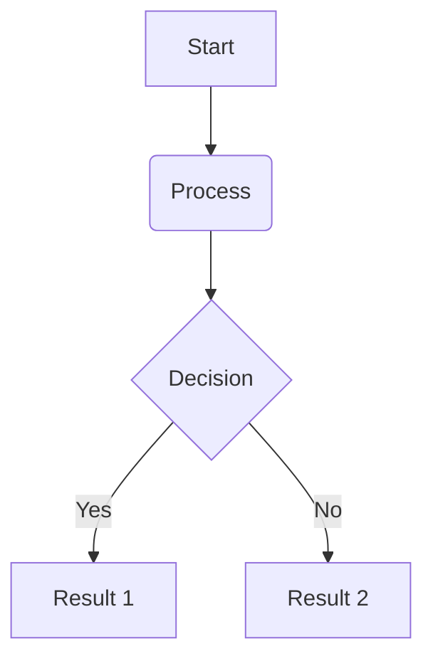

# Fortna Flexible Integration Routing Engine (Fire)

This document outlines the architecture for defining, creating, and managing all device interfaces within the Warehouse Control System.

## Overview

There are two main components:

1.  **`IDevice`:** # Device Management System

This document outlines the architecture for defining, creating, and managing all hardware devices (e.g., printers, scanners, PLCs, scales) within the Warehouse Control System.

## Overview

The system is split into two primary components:

1.  **`Device`:** An interface to en external system or a physical or piece of hardware. No device in the system knows about another device in the system.  The core of the system knows very little about a device, only what is defined in the IDevice Contract.
2.  **`DeviceManager`:** A singleton service that acts as a registry and factory. It is responsible for loading all device configurations, instantiating the correct device objects, and providing other services access to them.



2.  **`DeviceManager`:** A singleton service that acts as a registry and factory. It is responsible for loading all device configurations, instantiating the correct device objects, and providing other services access to them.

Other services (like an order fulfillment service) should **never** create a device instance directly. They should *always* ask the `DeviceManager` for a device.

```mermaid
graph TD
    subgraph "Other Services (Consumers)"
        WorkService[WorkOrchestrationService]
    end

    subgraph "Device Management System"
        DevManager(DeviceManager) -- "Gets device for" --> WorkService
        DevManager -- "Loads/Creates" --> Devices
        
        subgraph "Device Implementations"
            direction LR
            IDevice["IDevice (Interface)"]
            Printer[PrinterDevice]
            Scanner[ScannerDevice]
            Plc[PlcDevice]
        end

        IDevice <|.. Printer
        IDevice <|.. Scanner
        IDevice <|.. Plc

        Devices[Device Instances] -.-> Printer
        Devices -.-> Scanner
        Devices -.-> Plc
    end

    style IDevice fill:#f9f,stroke:#333,stroke-width:2px