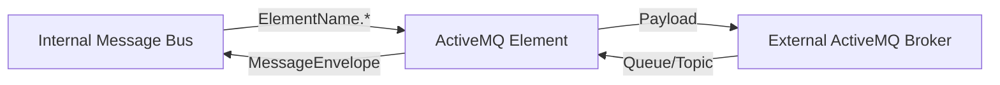

# Fusion.Element.ActiveMQ

## Purpose
The ActiveMQ element provides a bridge between the internal FortnaFire Message Bus and external ActiveMQ brokers. It manages connection pooling, automatic reconnection, and message translation between internal envelopes and external JMS-compatible messages.

## Messages In
| Source | Topic/Queue Pattern | Description |
| :--- | :--- | :--- |
| **Internal Bus** | `ElementName.MessageType.Discriminator` | Messages published to topics starting with the ActiveMQ element name are sent to the external MQ. |
| **External MQ** | `Destination.Discriminator` | The element subscribes to external queues/topics to bring messages into the system. |

## Messages Out
| Destination | Topic/Queue Pattern | Description |
| :--- | :--- | :--- |
| **External MQ** | `Source.Discriminator` | Payloads from the internal bus are stripped of their envelope and sent to this external queue. |
| **Internal Bus** | `Destination` | Messages consumed from external MQ are wrapped in a `MessageEnvelope` and published to the internal bus. |

## Key Features
* **Automatic Reconnection**: Built-in logic to monitor connection health and restore sessions if the broker becomes unavailable.
* **DoubleQueue Support**: If enabled, every message written to or consumed from a queue is also mirrored to a secondary queue (suffixed with '2') to aid in testing and auditing.
* **Thread-Safe Routing**: Uses concurrent collections and session pooling to ensure high-performance message dispatching.

## Configuration Properties
The following properties can be configured in the `Properties` dictionary of the Element Blueprint:

### ActiveMqManager
| Property | Type | Default | Description |
| :--- | :--- | :--- | :--- |
| **ConnectionString** | `string` | **Required** | The broker URI (e.g. `tcp://127.0.0.1:61616`). |
| **DefaultReadQueue** | `string` | `""` | The primary queue to consume messages from. |
| **DefaultWriteQueue** | `string` | `""` | The primary queue to write messages to. |
| **DoubleQueue** | `bool` | `false` | If true, mirrors all messages to a secondary queue (e.g. `QueueName2`). |

## Mermaid Chart

