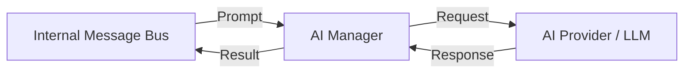

# Fusion.Element.Ai.Suite

## Purpose
Provides AI capabilities within the Fusion ecosystem by wrapping various AI models (e.g. Google Gemini) and providing a standardized interface for chat and logical reasoning.

## Messages In
| Source | Type | Description |
| :--- | :--- | :--- |
| **Internal Bus** | `ElementName.Request` | Natural language prompt or task for the AI to process. |

## Messages Out
| Destination | Type | Description |
| :--- | :--- | :--- |
| **Internal Bus** | `ElementName.Response` | The AI's generated response or reasoning result. |

## Configuration Properties
The following properties can be configured in the `Properties` dictionary of the Element Blueprint:

### AiElementManager
| Property | Type | Default | Description |
| :--- | :--- | :--- | :--- |
| **ApiKey** | `string` | `""` | The API key for the configured AI provider (e.g. Gemini). |
| **Model** | `string` | `gemini-1.5-pro-latest` | The model identifier to use. |

## Mermaid Chart

