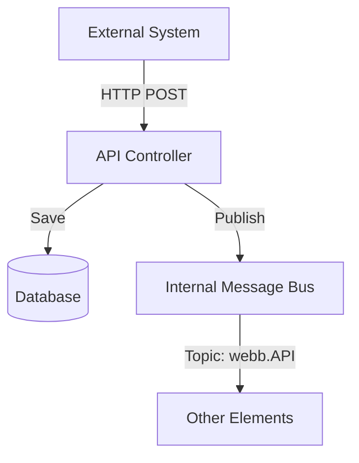

# Fusion.Element.Api.Suite

## Purpose
Provides a standardized REST API and background listeners for external systems (web interfaces, third-party integrations) to interact with the FortnaFire system. It facilitates entity management and command execution via HTTP.

## Messages In
| Source | Type | Description |
| :--- | :--- | :--- |
| **External System** | HTTP GET/POST/PUT | RESTful requests to manage entities or trigger system actions. |
| **External Bus** | Bus Topic | Background listeners (e.g., `WcsMessageListener`) can subscribe to external messaging systems. |

## Messages Out
| Destination | Topic Pattern | Description |
| :--- | :--- | :--- |
| **Internal Bus** | `webb.API` | Successful API operations (like entity creation) are broadcast to the system bus. |
| **External System** | HTTP Response | Synchronous feedback for REST requests. |

## Configuration Properties
The `ApiElementManager` typically uses standard ASP.NET Core configuration (e.g. `appsettings.json`) for its listening ports and authentication settings. However, the following properties can be overridden in the Element Blueprint:

| Property | Type | Default | Description |
| :--- | :--- | :--- | :--- |
| **ApiPort** | `int` | `5000` | The HTTP port for the REST API. |
| **EnableAuth** | `bool` | `false` | Enables basic authentication for API endpoints. |

## Mermaid Chart

