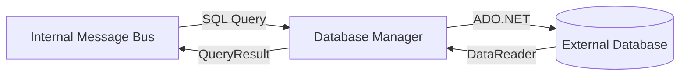

# Fusion.Element.Database.Suite

## Purpose
Acts as the persistence gateway for the system. It allows other elements and reactions to execute SQL queries and commands against Microsoft SQL Server, MySQL, PostgreSQL, or DuckDB databases using a standardized message-based interface.

## Messages In
| Source | Topic Pattern | Payload Requirements |
| :--- | :--- | :--- |
| **Internal Bus** | `ElementName.Database.Command` | Must contain `Sql`, `Operation` (QUERY/EXECUTE), and optional `Parameters`. |

## Messages Out
| Destination | Topic Pattern | Description |
| :--- | :--- | :--- |
| **Internal Bus** | `ElementName.QueryResult.Discriminator` | Results from a `QUERY` operation, returned as a JSON collection of rows. |
| **Database** | SQL Command | Direct execution of the SQL string against the configured database provider. |

## Configuration Properties
The following properties can be configured in the `Properties` dictionary of the Element Blueprint:

### DatabaseElementManager
| Property | Type | Default | Description |
| :--- | :--- | :--- | :--- |
| **DatabaseType** | `string` | `"MsSql"` | Selects the provider: `MsSql`, `MySql`, `PostgreSql`, `DuckDb`, or `Pruning`. |
| **ConnectionString** | `string` | `""` | The database connection string. |
| **Initialize** | `bool` | `false` | If true, attempts to create the database/schema on startup. |
| **Database** | `string` | `""` | DuckDB only: path to a `.duckdb` file or `:memory:` for an in-memory database. Used when `ConnectionString` is empty; defaults to `:memory:` when both are empty. |

## Mermaid Chart

