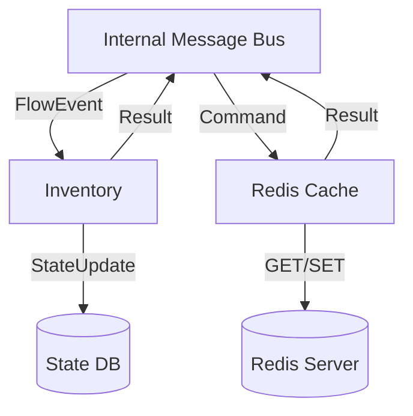

# Fusion.Element.Enterprise.Suite

## Purpose
A collection of high-level system services including Telemetry (OpenTelemetry integration), Inventory (real-time container tracking), Logging (centralized Fire logs), and Redis Caching.

## Messages In
| Service | Source Topic | Description |
| :--- | :--- | :--- |
| **Telemetry** | `DataFlow`, `ElementStatus` | Observes all traffic for performance metrics and tracing. |
| **Inventory** | `DataFlow`, `*.QUERY` | Tracks container locations and responds to state queries. |
| **Redis** | `*.SET`, `*.GET` | Simple key-value cache operations. |
| **Logging** | (Various) | Consolidates system logs for enterprise visibility. |

## Messages Out
| Service | Destination Topic | Description |
| :--- | :--- | :--- |
| **Inventory** | `*.RESULT.{gin}` | Returns current location and state of a container. |
| **Redis** | `*.RESULT.{key}` | Returns the cached value for a requested key. |
| **Telemetry** | OTLP / Console | Exports metrics and spans to external collectors. |

## Configuration Properties
The following properties can be configured in the `Properties` dictionary of the Element Blueprint:

### RedisCacheManager
| Property | Type | Default | Description |
| :--- | :--- | :--- | :--- |
| **ConnectionString** | `string` | `localhost:6379` | The Redis connection string. |
| **DefaultChannel** | `string` | `fusion-default` | The default channel for generic publish operations. |

### TelemetryManager
| Property | Type | Default | Description |
| :--- | :--- | :--- | :--- |
| **ServiceName** | `string` | `FusionService` | The service name reported to OpenTelemetry. |
| **OtlpEndpoint** | `string` | `http://localhost:4317` | The OTLP collector endpoint. |

## Mermaid Chart

