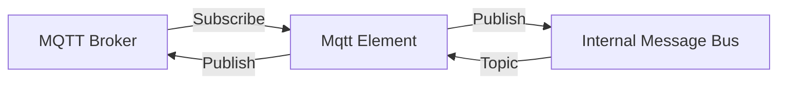

# Fusion.Element.Mqtt

## Purpose
Enables integration with MQTT brokers, allowing the system to participate in IoT-style messaging architectures. It maps MQTT topics to internal bus topics and vice versa.

## Messages In
| Source | Pattern | Description |
| :--- | :--- | :--- |
| **MQTT Broker** | `fusion/elements/#` | Subscribed MQTT topics are translated to internal bus topics. |
| **Internal Bus** | `ElementName.*` | Published to the MQTT broker. |

## Messages Out
| Destination | Pattern | Description |
| :--- | :--- | :--- |
| **Internal Bus** | Translated Topic | MQTT payloads are wrapped and published internally. |
| **MQTT Broker** | `{Topic}/response` | Messages from the internal bus are published to the broker. |

## Configuration Properties
The following properties can be configured in the `Properties` dictionary of the Element Blueprint:

### MqttManager
| Property | Type | Default | Description |
| :--- | :--- | :--- | :--- |
| **Host** | `string` | `127.0.0.1` | The MQTT broker IP address or hostname. |
| **Port** | `int` | `1883` | The MQTT broker port (standard is 1883). |
| **ClientId** | `string` | `ElementName` | The unique client identifier for the connection. |
| **Topic** | `string` | `fusion/elements/#` | The MQTT topic pattern to subscribe to. |

## Mermaid Chart

