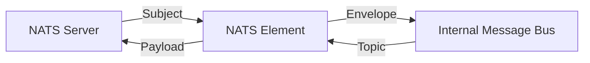

# Fusion.Element.Nats

## Purpose
Provides a high-performance bridge to NATS messaging systems. It utilizes NATS.Net V2 for efficient, asynchronous message routing between internal and external subjects.

## Messages In
| Source | Subject/Topic Pattern | Description |
| :--- | :--- | :--- |
| **NATS Server** | Subscribed Subjects | External NATS messages mapped to internal topics. |
| **Internal Bus** | `ElementName.*` | Internal messages to be published to NATS. |

## Messages Out
| Destination | Subject/Topic Pattern | Description |
| :--- | :--- | :--- |
| **Internal Bus** | `ElementName.Inbound.*` | Messages received from NATS published to the bus. |
| **NATS Server** | Discriminator Subject | Payloads from the bus published to NATS subjects. |

## Configuration Properties
The following properties can be configured in the `Properties` dictionary of the Element Blueprint:

### NatsManager
| Property | Type | Default | Description |
| :--- | :--- | :--- | :--- |
| **Url** | `string` | `nats://127.0.0.1:4222` | The NATS server connection URL. |
| **DefaultWriteSubject**| `string` | `ElementName.out` | Default NATS subject for outbound messages. |

## Mermaid Chart

