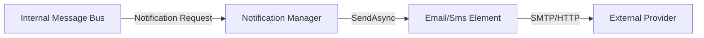

# Fusion.Element.Notification.Suite

## Purpose
Handles outbound notifications via Email (SMTP) and SMS (Twilio/Modem). It is a passive element that listens for notification requests and dispatches them to external providers.

## Messages In
| Source | Topic Pattern | Description |
| :--- | :--- | :--- |
| **Internal Bus** | `ElementName.Notify.*` | Payload contains the message text and recipient details. |

## Messages Out
| Destination | Type | Description |
| :--- | :--- | :--- |
| **External Provider** | SMTP / API | Dispatched Email or SMS message. |

## Configuration Properties
The following properties can be configured in the `Properties` dictionary of the Element Blueprint:

### EmailManager
| Property | Type | Default | Description |
| :--- | :--- | :--- | :--- |
| **SmtpHost** | `string` | **Required** | SMTP server address. |
| **SmtpPort** | `int` | `587` | SMTP server port. |
| **Username** | `string` | `""` | SMTP login username. |
| **Password** | `string` | `""` | SMTP login password. |
| **EnableSsl** | `bool` | `true` | Enable SSL/TLS for SMTP. |
| **FromAddress** | `string` | **Required** | The sender's email address. |
| **DefaultRecipient**| `string`| `admin@example.com` | Fallback recipient for notifications. |
| **DefaultSubject** | `string`| `Fusion Notification` | Fallback subject for emails. |

## Mermaid Chart

