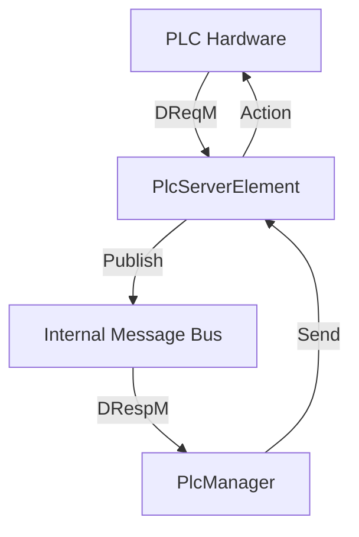

# Fusion.Element.Plc.Suite

## Purpose
The `Fusion.Element.Plc.Suite` serves as a high-performance communication gateway between the **Fire** warehouse control system and various **PLCs**. It implements the `WES-Routing Interface Message Specification` to facilitate seamless data exchange for warehouse automation tasks.

## Messages In
| Source | Type | Description |
| :--- | :--- | :--- |
| **PLC Hardware** | TCP (STX/ETX) | Decision Requests (DReqM) and Updates (DUM) from the field. |
| **Internal Bus** | `ElementName.DRespM.*` | Routing instructions/actions (Decision Responses) to be sent to the PLC. |

## Messages Out
| Destination | Type | Description |
| :--- | :--- | :--- |
| **Internal Bus** | `ElementName.DReqM.*` | PLC requests published for reaction logic processing. |
| **PLC Hardware** | TCP (STX/ETX) | Framed Decision Responses sent to the hardware. |

## Core Components
This library manages several key components for PLC orchestration:
* **PlcServerElement**: A TCP Socket Server that receives connections from PLCs to exchange Decision Requests, Updates, and Responses.
* **VirtualPlcElement**: A full simulation of the PLC client for development and testing environments.
* **PlcElementManager**: Coordinates the lifecycle of server elements and bonds outbound bus responses back to the correct PLC client.
* **PlcMessageParser**: Provides logic for framing JSON payloads into the protocol format and parsing raw strings into C# objects.

## Key Features
* **Asynchronous Throughput**: Uses Task-based operations for non-blocking network I/O.
* **Heartbeat Management**: Automatically handles bidirectional connection health monitoring.
* **Simulation Ready**: Includes a built-in Virtual PLC for local testing without physical hardware.

## Configuration Properties
The following properties can be configured in the `Properties` dictionary of the Element Blueprint:

### PlcElementManager (Server)
| Property | Type | Default | Description |
| :--- | :--- | :--- | :--- |
| **ElementPort** | `int` | **Required** | The TCP port the server listens on for PLC connections. |

### AbCipPlcManager (Allen-Bradley)
| Property | Type | Default | Description |
| :--- | :--- | :--- | :--- |
| **IPAddress** | `string` | `127.0.0.1` | The IP address of the physical AB PLC. |
| **CpuType** | `string` | `lgx` | PLC CPU type (`lgx` for ControlLogix, `slc` for SLC500). |
| **Path** | `string` | `1,0` | The CIP routing path to the processor. |
| **Port** | `int` | `44818` | The CIP port (standard is 44818). |
| **RequestTag** | `string` | `Fire_Request` | The PLC tag name for outbound Decision Requests. |
| **ResponseTag** | `string` | `Fire_Response` | The PLC tag name for inbound Decision Responses. |
| **UpdateTag** | `string` | `Fire_Update` | The PLC tag name for outbound Decision Updates. |

### VirtualPlcManager (Simulation)
| Property | Type | Default | Description |
| :--- | :--- | :--- | :--- |
| **Printer1** | `string` | `PNA2_151` | Default printer name for simulation logic. |
| **Printer2** | `string` | `PNA2_152` | Secondary printer name for simulation logic. |
| **DecisionPoints** | `string/list` | `null` | A semicolon-separated string or list of decision point identifiers. |
| **Scanners** | `list` | `[]` | A list of scanner configurations (DecisionPoint, IP, Port, TerminationChar). |

## Mermaid Chart

