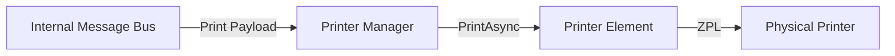

# Fusion.Element.Printer.Suite

## Purpose
Manages label printing operations for Zebra (ZPL) and JetMark printers. It acts as a passive consumer of print jobs from the Message Bus and coordinates with physical or virtual printers via TCP.

## Messages In
| Source | Topic Pattern | Payload Requirements |
| :--- | :--- | :--- |
| **Internal Bus** | `ElementName.PrintJob.*` | JSON payload containing `PrinterData` or `labels` (ZPL string). |

## Messages Out
| Destination | Type | Description |
| :--- | :--- | :--- |
| **Physical Printer** | TCP (Port 9100) | ZPL commands sent to the hardware. |

## Configuration Properties
The following properties can be configured in the `Properties` dictionary of the Element Blueprint:

### PrinterManager (Zebra / JetMark)
| Property | Type | Default | Description |
| :--- | :--- | :--- | :--- |
| **IPAddress** | `string` | `127.0.0.1` | The IP address of the printer. |
| **Port** | `int` | `9100` | The TCP port of the printer (standard is 9100). |

### VirtualPrinterManager (Simulation)
| Property | Type | Default | Description |
| :--- | :--- | :--- | :--- |
| **Port** | `int` | `9100` | The port the virtual printer server listens on. |

## Mermaid Chart

