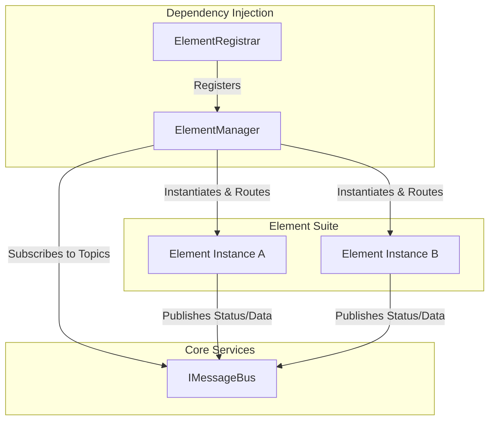
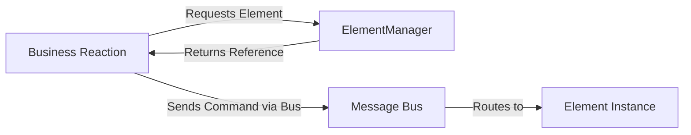

# Fortna Flexible Integration Routing Engine (Fire)

This document outlines the architecture for defining, creating, and managing all element interfaces within the Warehouse Control System.

## Overview

There are two main components:

1.  **`IElement`:** # Element Management System

This document outlines the architecture for defining, creating, and managing all hardware elements (e.g., printers, scanners, PLCs, scales) within the Warehouse Control System.

## Overview

The system is split into three primary components:

1.  **`Registrar`**: Responsible for scanning the assembly for managers and elements, and registering them with the Dependency Injection container.
2.  **`Manager`**: A singleton service that acts as a factory and supervisor for a specific type of element. It handles topic subscriptions and routes messages to the correct instances.
3.  **`Element`**: An interface to an external system or physical hardware. Elements are decoupled and communicate primarily through the message bus.

2.  **`ElementManager`**: A singleton service that acts as a registry and factory. It is responsible for loading all element configurations, instantiating the correct element objects, and providing other services access to them.

Other services (like an order fulfillment service) should **never** create a element instance directly. They should *always* ask the `ElementManager` for a element.

