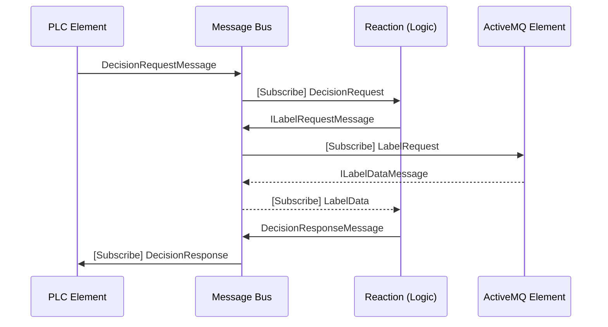

# Message Bus Topics

| Queue Name                                              |          Description           |                     Direction |
|:--------------------------------------------------------|:------------------------------:|------------------------------:|
| ElementStatusTopic3                                      | Queue for all status reporting |      Published by all elements |
| {PLCName},DecisionRequestMessage,{Decision Point}       |                                |       Published by PLC Element |
| {PLCName},DecisionUpdateMessage,{Decision Point}        |                                |       Published by PLC Element |                       **** |
| {PLCName},DecisionResponseMessage,{Decision Point}      |                                |      Subscribed by PLC Element |
| {ActiveMQName},ILabelRequestMessage,{ActiveMqQueueName} |                                | Subscribed by ActiveMQ Element |
| {ActiveMQName},ILabelDataMessage,{ActiveMqQueueName}    |                                |  Published by ActiveMQ Element |
| {PrinterName},LabelToPrintMessage                       |                                |   Subscribed By PrinterElement | 
