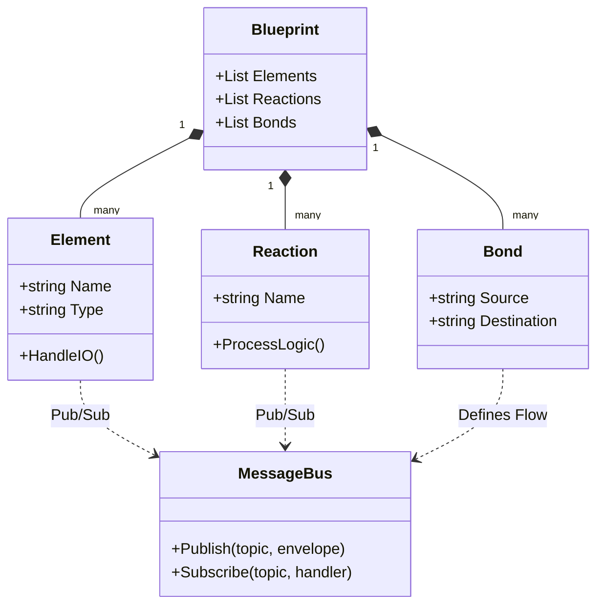

# Gemini Project Configuration

This file provides context to the Gemini CLI to help it understand the Fortna Fusion project.

## Project Overview

Fortna Fusion is a modular .NET 10 system designed for industrial automation and element orchestration. It manages communications and forces for logistics hardware, including PLCs, Zebra/JetMark printers, and ActiveMQ messaging, specifically focusing on "Print and Apply" automation bonds.

## Tech Stack

- **Language:** C# 14
- **Framework:** .NET 10.0
- **Project Types:** Console Applications and Class Libraries.
- **Messaging:** ActiveMQ
- **Testing:** xUnit
- **Key Libraries:** Castle.Core (DynamicProxy), Microsoft.Extensions.AI

## Key Commands

- **Build:** `dotnet build`
- **Run (Console):** `dotnet run --project Fusion.Console`
- **Run (Tokamak):** `dotnet run --project Tokamak.AI` (AI-powered Blueprint Builder & Provisioner)
- **Test:** `dotnet test`
- **Clean:** `dotnet clean`

## System Architecture

## File & Folder Structure

- `Fusion.Common/`: Shared models, enums, exceptions, and core utilities (TCP, Logging).
- `Fusion.Core/`: Core orchestration logic, message bus, and factory implementations.
- `Fusion.Element.Plc.Suite/`: PLC-specific connectors, message parsing, and state machines.
- `Fusion.Element.Printer.Suite/`: Zebra and JetMark printer integration and ZPL handling.
- `Fusion.Element.ActiveMQ/`: ActiveMQ message consumer and manager logic.
- `Fusion.Reaction.*/`: Specific business logic implementations (Reactions).
- `Tokamak.AI/`: AI-driven Blueprint (.fusion) generator and hardware provisioner.
- `Fusion.Console/`: Primary entry point for the application dashboard.

## Naming Conventions (Fusion)
- **Elements**: Hardware elements or external interfaces (formerly Elements).
- **Reactions**: Business logic reactions and orchestrators (formerly Reactions).
- **Bonds**: Subscriptions and connections between elements and forces (formerly Bonds).
- **Blueprints**: System configuration files using the `.fusion` extension (formerly Chamber files).

## Coding Style

- Use modern C# 14 features (Primary constructors, collection expressions, etc.).
- Maintain nullable reference types awareness.
- Follow the established pattern of "Registrar" classes for dependency injection/container setup.
